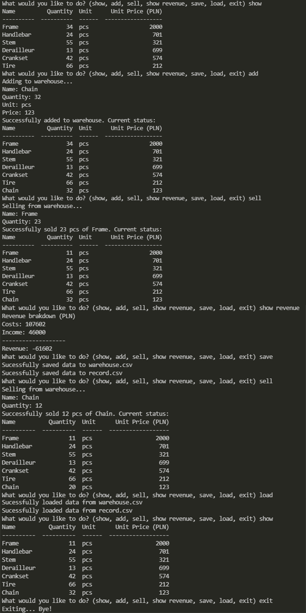

# Warehouse Manager
> Outline a brief description of your project.

## General Information
- Provide general information about your project here.
- What problem does it (intend to) solve?
- What is the purpose of your project?
- Why did you undertake it?
<!-- You don't have to answer all the questions - just the ones relevant to your project. -->

## Technologies Used
- Tech 1 - version 1.0
- Tech 2 - version 2.0
- Tech 3 - version 3.0

## Features
List the ready features here:
- Awesome feature 1
- Awesome feature 2
- Awesome feature 3

## Screenshots

## Usage
Download repository.
Run cmd or Powershell.
Type 'python warehouse_manager.py' or 'py warehouse_manager.py'
Follow the on-screen instructions.

## Project Status
Project is: _in progress_.
Need to add tests.
